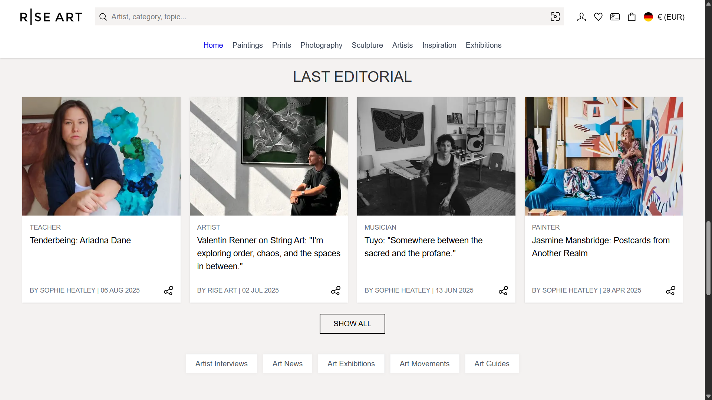

📑 ArtGallery

ArtGallery is a fully responsive website for showcasing and selling paintings and art pieces. Each artwork has its own dynamic page, allowing users to view detailed information and images when clicking on a specific piece.

- ✅ **Next.js** & **TypeScript** & **Tailwind**

✨ Features:

- Displays a gallery of paintings with titles, short descriptions, and preview images

- Uses dynamic URLs for each artwork (e.g., /gallery/starry-night)

- Dynamically loads the content of each painting on its dedicated page

- Fully responsive and user-friendly design for mobile, tablet, and desktop

-------------------------------------   
📸 Preview

  
  

-------------------------------------
🚀 How to install and run
- git clone https://github.com/MisaqArtist7/ArtGallery.git
- cd ArtGallery
- npm install
- npm run dev
- Open http://localhost:3000 in your browser.

- Preview: https://art-gallery-e4wq.vercel.app/

